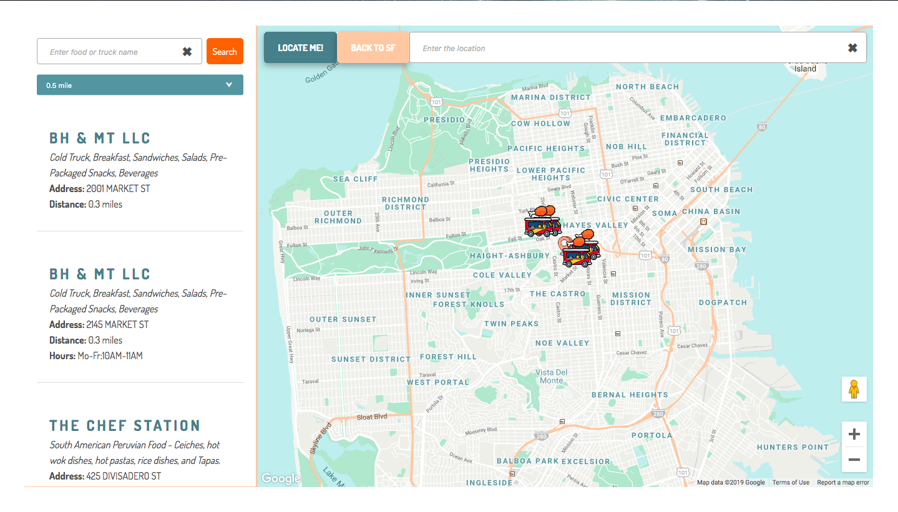
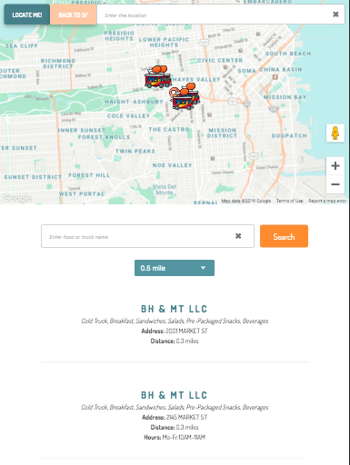

# NOM NOM - SF FOOD TRUCK FINDER

**A React web app for finding local SF Food Trucks in specific location**

### Hosted application

[Nom Nom](https://nom-nom-baa86.firebaseapp.com/)

### Technical Track

Front End: React, Redux, Sass.

Since the result need to be updated everytime users pick different location or search for food or truck's name, redux is great for managing state and the components in React can have access to the store easily.

### Features

* Click on any position on the map and it will show food trucks around the location.
* Users can type address in SF to find food trucks nearby (Use google map Autocomplete to render suggestions of location).
* Used geolocation to access to users' location and render food truck around the locaton (better to test if you are in SF).
* The food truck information has name of the truck, type of food, distance within 0.5 mile of that location, hours of operation and directions to the truck using google maps.
* Users can search for food truck name or food type, the map and the food truck list will render result based on the search input (Used autosuggesst to match the search input).
* Users can filter radius: 0.25 mile, 0.5 mile (default), 1 mile from the location.
* All the results are sorted by distance.
* Applied Mobile Responsive Design

### Future Plans

* Filter hours of operation
* Filter food type
* Apply Testing

### Profile

[Portfolio](http://www.linhhuynh.net/)
